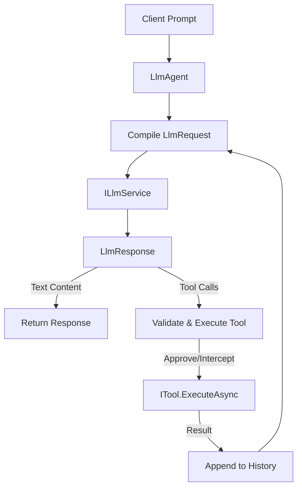

# Agent Development Kit (ADK) — Developer Manual

The **Agent Development Kit (ADK)** is a native .NET library designed for constructing modular, resilient, and telemetry-observable AI agents. Rather than treating LLMs as simple chat interfaces, the ADK models them as agentic actors equipped with structured tools, multi-agent delegation frameworks, session memory providers, and human-in-the-loop safeguards.

---

## 1. System Architecture

The core of the ADK revolves around the orchestration loop of the `LlmAgent`. An agent consists of:
- **Identity & Instructions**: System prompts defining the persona, domain limits, and expected behavior.
- **Model Client (`ILlmService`)**: A pluggable engine interface supporting Google Gemini, OpenAI, or local/mock models.
- **Tools (`ITool`)**: Structured actions the model can request to execute, defining parameters via JSON Schema.
- **Session History (`ISessionProvider`)**: Context storage tracking conversations across restarts (e.g., in a SQLite backing store).



### Context & Token Management
Since agent execution is iterative (requiring multiple LLM invocations for tool execution), context management is critical. Every tool call adds a pair of messages to the history:
1. A **Model** message detailing the requested function call.
2. A **Function** message containing the return payload.

To prevent memory leaks or context exhaustion, the `LlmAgent` relies on the `ISessionProvider` to append and fetch history, while the developer is responsible for session recycling or log rotation.

---

## 2. API Reference & Interface Specifications

### ITool
Tools represent the capabilities exposed to the LLM. They must specify their parameters using JSON Schema.

```csharp
namespace Glacier.AgentDevKit.Adk;

public interface ITool
{
    string Name { get; }
    string Description { get; }
    JsonNode GetParametersSchema();
    Task<string> ExecuteAsync(string arguments);
}
```

* **`Name`**: The technical name of the tool (must match regex `^[a-zA-Z0-9_-]{1,64}$`).
* **`Description`**: A description explaining *when* and *how* the agent should invoke this tool.
* **`GetParametersSchema()`**: Returns a standard JSON Schema object representing expected arguments.
* **`ExecuteAsync()`**: Performs the operation. Returns a string payload (preferably JSON).

### ILlmService
The model adapter interface. The ADK includes implementations for `GeminiService` and `OpenAiService`.

```csharp
public interface ILlmService
{
    Task<LlmResponse> GenerateContentAsync(LlmRequest request);
    IAsyncEnumerable<LlmResponse> StreamGenerateContentAsync(LlmRequest request);
}
```

### ISessionProvider
Enables chat memory persistence across restarts.

```csharp
public interface ISessionProvider
{
    Task<List<LlmContent>> GetHistoryAsync(string sessionId);
    Task SaveMessageAsync(string sessionId, LlmContent message);
}
```

---

## 3. Core Capabilities & Advanced Orchestration Patterns

The ADK natively supports multi-agent patterns to solve complex pipelines.

### Pattern 1: Multi-Agent Delegation
You can register an agent as a tool inside another agent's toolbox using `DelegationTool`. This allows the lead coordinator (e.g., an Acquisition Manager) to offload subtasks to specialized analysts.

```csharp
var analyst = new LlmAgent("PolarisAnalyst", "gemini-2.5-flash", "Filters listings...", "instructions...", tools);
var manager = new LlmAgent("Manager", "gemini-2.5-flash", "Coordinates team...", "instructions...", new List<ITool>());

// Add delegation tool to manager
manager.Tools.Add(new DelegationTool(
    name: "DelegateToPolarisAnalyst",
    description: "Filters Airbnb listings by price and reviews.",
    specialistAgent: analyst,
    llmService: llmService
));
```

### Pattern 2: Sequential Pipeline
In a pipeline, output from one agent is fed directly as the input to the next.

```csharp
var filterAgent = new LlmAgent("FilterAgent", "gemini-2.5-flash", ...);
var summarizeAgent = new LlmAgent("Summarizer", "gemini-2.5-flash", ...);

var filteredText = await filterAgent.RunAsync("Search cheap rooms in Islington", llm);
var finalSummary = await summarizeAgent.RunAsync($"Summarize these listings:\n{filteredText}", llm);
```

### Pattern 3: Self-Correction Loop
If the LLM generates a tool call parameter that fails validation, the ADK automatically intercept the error, logs it, appends the error feedback to the history, and requests the LLM to rewrite the call up to `MaxRetries`.

```csharp
var agent = new LlmAgent("ResilientAgent", "gemini-2.5-flash", ...)
{
    MaxRetries = 3 // Self-corrects JSON syntax or schema errors up to 3 times
};
```

---

## 4. Security, Interceptors, and HITL Approvals

### Human-in-the-Loop (HITL)
By wrapping a tool in a `SensitiveTool` and configuring an `IApprovalService`, the agent's run loop will pause before execution and request human consent.

```csharp
public class ConsoleApprovalService : IApprovalService
{
    public async Task<bool> ApproveAsync(string toolName, string arguments)
    {
        Console.ForegroundColor = ConsoleColor.Yellow;
        Console.WriteLine($"[HITL] Tool '{toolName}' requested with args: {arguments}");
        Console.Write("Approve? (y/n): ");
        var input = Console.ReadLine();
        Console.ResetColor();
        return input?.ToLower() == "y";
    }
}

// Setup agent
var deleteDbTool = new SensitiveTool(new DeleteTableTool());
agent.Tools.Add(deleteDbTool);
agent.ApprovalService = new ConsoleApprovalService();
```

### Guardrail Interceptors
The `BeforeToolCall` delegate lets you audit, rewrite, or reject arguments before they are forwarded to the tool.

```csharp
agent.BeforeToolCall = async (tool, args) =>
{
    // Sanitize file path inputs
    if (args.Contains("..") || args.Contains("/") || args.Contains("\\"))
    {
        throw new SecurityException("Directory traversal attempt blocked.");
    }
    return args; // Continue execution with sanitized args
};
```

---

## 5. Model Context Protocol (MCP) Integration

The ADK supports standard Model Context Protocol servers. You can load tools dynamically from external MCP server instances.

```csharp
var mcpService = new McpService();
// Load servers configured via json
var mcpTools = await mcpService.InitializeFromConfigAsync("mcp-config.json");
agent.Tools.AddRange(mcpTools);
```

An example `mcp-config.json`:
```json
{
  "mcpServers": {
    "sqlite-server": {
      "command": "npx",
      "args": ["-y", "@modelcontextprotocol/server-sqlite", "--db", "listings.db"]
    }
  }
}
```

---

## 6. Telemetry & Observability

The ADK implements native OpenTelemetry tracking via `System.Diagnostics.Activity` and metrics counters.

### Trace Instruments
- **Activity Source**: `Glacier.AgentDevKit.Adk`
- **Activities**:
  - `Run [AgentName]`: Tracks the full execution run of an agent.
  - `Stream [AgentName]`: Tracks streaming tokens.
  - `ToolCalls [AgentName]`: Measures the tool call routing layer.
  - `Invoke [ToolName]`: Profiles individual tool execution times.

### Metric Instruments
- `glacier.adk.agent_runs`: Counter tracking total agent executions.
- `glacier.adk.tool_executions`: Counter tracking total tool invocations.

### Configuration Example
To stream traces to Jaeger, Zipkin, or OpenTelemetry collector:

```csharp
using OpenTelemetry;
using OpenTelemetry.Resources;
using OpenTelemetry.Trace;

var tracerProvider = Sdk.CreateTracerProviderBuilder()
    .SetResourceBuilder(ResourceBuilder.CreateDefault().AddService("MyAgentApp"))
    .AddSource("Glacier.AgentDevKit.Adk")
    .AddConsoleExporter() // or AddOtlpExporter()
    .Build();
```
