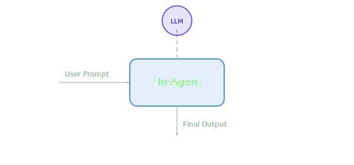
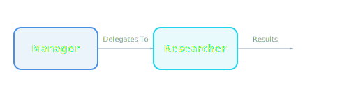
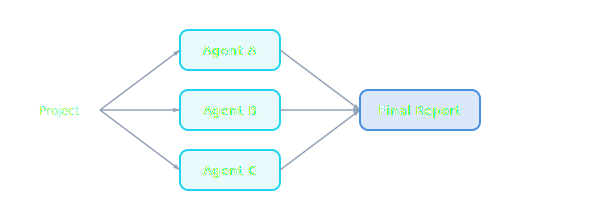
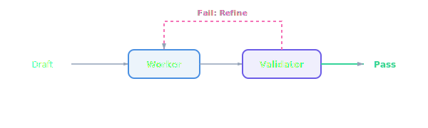
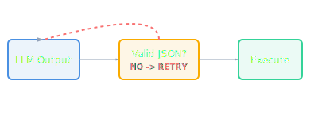

# Agent Development Kit (ADK)

Welcome to the **Agent Development Kit**. This C# library is designed to help you create "Agents"—AI personalities that don't just talk, but **think, plan, and act** using real-world tools.

## What is an Agent?

Think of it as a specialized job description for an AI. While ChatGPT is a generalist, an ADK Agent is an expert (like a "Database Researcher" or "Python Expert") equipped with the specific tools and instructions needed for that role.

---

## Why Agent Development Kit (ADK)?

This project was inspired by the official Google Agent SDKs available for other languages. Recognizing that a robust, production-ready C# implementation was missing, this ADK was created to **fill that gap**.

It provides .NET developers with a native, high-performance way to build sophisticated AI agents using Google's Gemini models and the Model Context Protocol (MCP), while following established patterns for agent orchestration.

---

## The Brain

At the center of everything is the `LlmAgent`. It takes your instructions and uses a **Language Model** (like Google Gemini or Google Gemma) to decide what to do next.


*Figure 1: High-level Agent Architecture showing the loop of thought.*

### Getting Started

```csharp
// 1. Setup the Brain connections
var llm = new GeminiService(apiKey);

// 2. Create your Agent character
var agent = new LlmAgent(
    name: "ChefBot",
    instructions: "You are an expert chef. Give short, punchy recipes."
);

// 3. Ask it a question
string result = await agent.RunAsync("How do I make a grilled cheese?", llm);
```

---

## The Hands (Tools)

Tools are what make agents truly powerful. Without tools, an AI can only talk. With tools, an AI can **read files, calculate math, or search the web.**

> [!NOTE]
> **Dynamic Capability:** When an agent realizes it needs information it doesn't have (like the current time or a file's contents), it will automatically pause, call a Tool, and use the result to finish its reply.

```csharp
// Define a new capability
public class FileReadTool : ITool { ... }

// Give the hands to the agent
agent.Tools.Add(new FileReadTool());
```

---

## The Memory

By default, AI models have "Goldfish Memory"—they forget every request as soon as it's done. Our SDK uses **Sessions** to give them long-term memory.

```csharp
// Using Sqlite lets your agent remember things even if you restart the app!
var memory = new SqliteSessionProvider("Data Source=agents.db");

// Load the history for "User_42"
var (history, save) = await memory.GetSessionAsync("User_42");

// Run the agent with that history
var response = await agent.RunAsync(prompt, llm, history);

// Save the new conversation part
await save(agent.History);
```

---

## Building Teams (Delegation)

One agent is smart, but a **Team of Agents** is unstoppable. You can give one agent (The Manager) another agent (The Specialist) as a tool.


*Figure 2: The Delegation Tool pattern.*

```csharp
var researcher = new LlmAgent("Researcher", "Find facts...");
var manager = new LlmAgent("Manager", "Guide the project...");

// Manager now has a "Researcher Tool"
manager.Tools.Add(new DelegationTool(researcher, llm));
```

---

## Design Patterns

Orchestration helps you solve huge problems by breaking them into patterns. These three patterns are the foundation of all advanced agent workflows.

### 1. Sequential Pipeline
The simplest pattern. Data flows in a straight line from one expert to another. Each agent refines or transforms the output of the previous one.


*Figure 3: Sequential flow. Ideal for cleaning, translating, or formatting data.*

### 2. Parallel Workflow
Perfect for speed. One task is divided and sent to multiple agents at once. A "merger" step then combines their findings into a single response.


*Figure 4: Parallel execution. Used for searching multiple sources simultaneously.*

### 3. Loop Workflow
For high-quality results. An agent creates content, and a "Validator" checks it against rules. If it fails, the agent is told what to fix and tries again.


*Figure 5: Loop pattern. Great for code generation or fact-checking.*

---

## Dynamic Tools (MCP)

The **Model Context Protocol** is an industry standard. It lets your agent "plug in" to a database, a local file system, or a web search engine without writing any custom C# code.

```csharp
// Auto-connect to a local SQLite database using MCP
var mcp = new McpService();
var databaseTools = await mcp.InitializeFromConfigAsync(config);

agent.Tools.AddRange(databaseTools);
```

---

## Security & Safety

In the real world, agents can be dangerous. Our SDK provides **Guardrails** and **Manual Approvals** to keep your agents safe and compliant.

> [!IMPORTANT]
> **Human-in-the-Loop (HITL):** By wrapping a tool in `SensitiveTool`, you ensure the agent **cannot** run it without explicit permission from a human using the `IApprovalService`.

```csharp
// 1. Define a tool as "Sensitive"
var tool = new SensitiveTool(new DeleteDatabaseTool());

// 2. Provide an approval mechanism (e.g. CLI, Web, or Email)
agent.ApprovalService = new ConsoleApprovalService();
```

### Guardrail Interceptors
Use the `BeforeToolCall` hook to modify or block requests before they reach a tool. This is perfect for **Path Sanitization** or **Token Filtering**.

```csharp
agent.BeforeToolCall = async (tool, args) => {
    if (args.Contains("..")) {
        throw new SecurityException("Path breakout attempt!");
    }
    return args;
};
```

---

## 🛡️ Robustness & Retries

Modern LLMs (especially smaller local ones) can sometimes produce malformed JSON or include conversational noise when calling tools. The ADK includes built-in safeguards to handle these scenarios.

### Resilient Parsing & Self-Correction
The SDK automatically "extracts" JSON blocks from noisy strings. If a tool call is still invalid, the agent provides feedback to the model and automatically retries the request.


*Figure 6: The Self-Correction Loop for malformed outputs.*

```csharp
// Configure a robust agent with a retry budget
var agent = new LlmAgent(...) {
    MaxRetries = 3 // Automatically fix malformed output up to 3 times
};
```

---

## Seeing the Logic (Telemetry)

Ever wonder why an AI said something? Our SDK has built-in **OpenTelemetry**. You can watch the "mental flow" of your agents in production-grade dashboards.

> [!TIP]
> **Visibility:** Track exactly how many tokens were used, how much it cost, and the specific sequence of tool calls that led to an answer.

---

## Credits

Developed by **Ian Cowley** and **Antigravity** (Google DeepMind).
